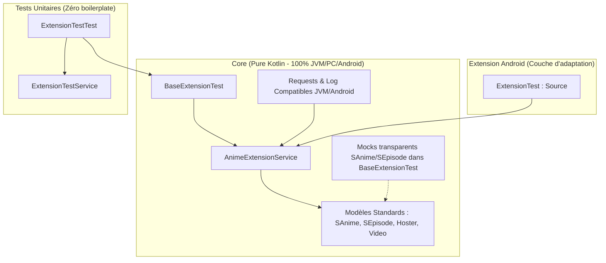

# TODO - Refactorisation et Dette Technique

## Priorité Haute / Performance
- [ ] **Migration vers le Non-Bloquant** : Convertir tous les appels `client.newCall(...).execute()` restants en `.awaitSuccess()` ou `.await()` dans toutes les extensions (`src/fr/`).
  - *Objectif : Libérer les threads des coroutines pour permettre un chargement véritablement parallèle des serveurs et éviter les délais de 30s.*

---

# Guide de Refactorisation : Clean Architecture & Tests Multiplateformes (Zéro Mock)

Ce document résume les modifications apportées par la branche de refactorisation par rapport à `dev` et fournit le guide pour migrer toutes les autres extensions vers la nouvelle architecture basée sur des services.

## 🏗️ Architecture Découplée



---

## 📊 Résumé des Changements (vs branch `dev`)

1. **Suppression de la dépendance Android pour les Requêtes & Logs** :
   - Les imports `android.util.Log` dans le `:core` (extracteurs et utilitaires) ont été remplacés par `fr.bluecxt.core.utils.Log`. Il détecte automatiquement s'il tourne sur Android ou sur JVM/PC (tests unitaires) pour éviter les plantages de stubs.
   - La dépendance réseau `eu.kanade.tachiyomi.network` a été remplacée par `fr.bluecxt.core.network` pour permettre des requêtes HTTP pures sur la JVM.
2. **Migration du package utilitaire** :
   - Le package `keiyoushi.utils` a été déplacé vers `fr.bluecxt.core.utils`, nettoyant les imports obsolètes dans plus de 40 fichiers.
3. **Découplage des Extracteurs de vidéos** :
   - La méthode principale de `Servers.kt` accepte maintenant directement `client: OkHttpClient` et `headers: Headers` sans dépendre de l'objet Android `Source`.
4. **Création de l'infrastructure de Test unitaire centralisée** :
   - `AnimeExtensionService.kt` définit le contrat des extensions (Popular, Latest, Search, Details, Episodes, Hosters, Videos).
   - `BaseExtensionTest.kt` centralise l'entièreté des assertions JUnit de flux et redirige de manière invisible les méthodes `SAnime.create()` et `SEpisode.create()` vers leurs implémentations réelles sans stub.

---

## 📘 Tutoriel : Convertir une extension (ex: `ADKami`)

### Étape 1 : Créer la classe Service (`ADKamiService.kt`)
Créez un fichier `ADKamiService.kt` dans le dossier de l'extension (par exemple `src/fr/adkami/src/eu/kanade/tachiyomi/animeextension/fr/adkami/`) :

```kotlin
package eu.kanade.tachiyomi.animeextension.fr.adkami

import eu.kanade.tachiyomi.animesource.model.AnimeFilterList
import eu.kanade.tachiyomi.animesource.model.AnimesPage
import eu.kanade.tachiyomi.animesource.model.Hoster
import eu.kanade.tachiyomi.animesource.model.SAnime
import eu.kanade.tachiyomi.animesource.model.SEpisode
import eu.kanade.tachiyomi.animesource.model.Video
import fr.bluecxt.core.model.AnimeExtensionService
import fr.bluecxt.core.network.GET // Requêtes réseau compatibles JVM/PC
import fr.bluecxt.core.network.awaitSuccess
import fr.bluecxt.core.utils.Log // Logger compatible JVM/PC
import okhttp3.Headers
import okhttp3.OkHttpClient

class ADKamiService(
    override val client: OkHttpClient,
    override val baseUrl: String,
    override val headers: Headers,
    override val supportsLatest: Boolean = true
) : AnimeExtensionService {

    override suspend fun getPopularAnime(page: Int): AnimesPage {
        // Logique de popularAnimeRequest/Parse de ADKami
    }

    override suspend fun getLatestUpdates(page: Int): AnimesPage {
        // Logique de latestUpdatesRequest/Parse de ADKami
    }

    override suspend fun getSearchAnime(page: Int, query: String, filters: AnimeFilterList): AnimesPage {
        // Logique de searchAnimeRequest/Parse de ADKami
    }

    override fun getFilterList(): AnimeFilterList = AnimeFilterList() // Filtres ici

    override suspend fun getAnimeDetails(anime: SAnime): SAnime {
        // Logique de animeDetailsRequest/Parse de ADKami
    }

    override suspend fun getEpisodeList(anime: SAnime): List<SEpisode> {
        // Logique de episodeListRequest/Parse de ADKami
    }

    override suspend fun getHosterList(episode: SEpisode): List<Hoster> {
        // Logique d'extraction des lecteurs
    }

    override suspend fun getVideoList(hoster: Hoster): List<Video> {
        // Logique d'extraction de vos vidéos via les extracteurs du core
    }
}
```

---

### Étape 2 : Épurer le Wrapper Android (`ADKami.kt`)
Remplacez le contenu de `ADKami.kt` pour déléguer les appels au nouveau service :

```kotlin
class ADKami : Source(), CommonPreferences {
    override val name = "ADKami"
    override val defaultBaseUrl = "https://www.adkami.com"
    override val baseUrl get() = defaultBaseUrl
    override val lang = "fr"
    override val supportsLatest = true

    // Surcharge le builder de headers final avec les headers du service
    override fun headersBuilder(): Headers.Builder = service.headers.newBuilder()

    private val service by lazy {
        ADKamiService(client, baseUrl, headers, supportsLatest)
    }

    override suspend fun getPopularAnime(page: Int): AnimesPage = service.getPopularAnime(page)
    override suspend fun getLatestUpdates(page: Int): AnimesPage = service.getLatestUpdates(page)
    override suspend fun getSearchAnime(page: Int, query: String, filters: AnimeFilterList): AnimesPage = service.getSearchAnime(page, query, filters)
    override fun getFilterList(): AnimeFilterList = service.getFilterList()
    override suspend fun getAnimeDetails(anime: SAnime): SAnime = service.getAnimeDetails(anime)
    override suspend fun getEpisodeList(anime: SAnime): List<SEpisode> = service.getEpisodeList(anime)
    override suspend fun getHosterList(episode: SEpisode): List<Hoster> = service.getHosterList(episode)
    override suspend fun getVideoList(hoster: Hoster): List<Video> = service.getVideoList(hoster)

    // Surcharges inutilisées requises par le framework (throw ou empty)
    override fun popularAnimeRequest(page: Int) = throw UnsupportedOperationException()
    override fun popularAnimeParse(response: Response) = throw UnsupportedOperationException()
    // ... même chose pour les autres méthodes parse/request ...
}
```

---

### Étape 3 : Créer le fichier de test unitaire (`ADKamiTest.kt`)
Créez un dossier `test` à côté du dossier `src` dans le module `adkami`, puis créez `ADKamiTest.kt` :

```kotlin
package eu.kanade.tachiyomi.animeextension.fr.adkami

import fr.bluecxt.core.test.BaseExtensionTest
import okhttp3.Headers
import okhttp3.OkHttpClient

class ADKamiTest : BaseExtensionTest(
    service = ADKamiService(
        client = OkHttpClient(),
        baseUrl = "https://www.adkami.com",
        headers = Headers.Builder().build()
    ),
    searchQuery = "Naruto" // Optionnel : recherche testée automatiquement (null pour désactiver)
)
```

---

### Étape 4 : Lancer le test unitaire
Exécutez la tâche Gradle pour valider en direct :
```bash
./gradlew :src:fr:adkami:test
```
