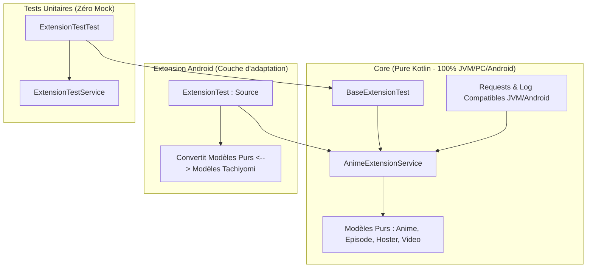

# Rapport de Transition : Clean Architecture & Tests Multiplateformes (Zéro Mock)

Nous avons mis en œuvre une architecture découplée (Clean Architecture) permettant de faire tourner les extensions et leurs tests unitaires de manière 100 % portable, sur n'importe quelle plateforme (Android, PC, CLI) sans aucun mock ni stub !

---

## 🏗️ Schéma de l'Architecture Découplée

---

## 🛠️ Composants implémentés

### 1. Modèles de Données Purs (`fr.bluecxt.core.model`)
Toutes les structures de données manipulées par les services et les extracteurs sont maintenant des classes Kotlin pures de base, sans héritage du framework Android ou de Tachiyomi. Elles s'instancient sur n'importe quelle machine sans aucun mock :
* [Anime.kt](file:///home/moi/git/anime-extensions-french/core/src/main/kotlin/fr/bluecxt/core/model/Anime.kt)
* [Episode.kt](file:///home/moi/git/anime-extensions-french/core/src/main/kotlin/fr/bluecxt/core/model/Episode.kt)
* [Hoster.kt](file:///home/moi/git/anime-extensions-french/core/src/main/kotlin/fr/bluecxt/core/model/Hoster.kt)
* [Video.kt](file:///home/moi/git/anime-extensions-french/core/src/main/kotlin/fr/bluecxt/core/model/Video.kt)

### 2. Interface Unifiée (`AnimeExtensionService.kt`)
Tous les services partagent la même interface pure Kotlin, facilitant la création de la suite de tests générique :
* [AnimeExtensionService.kt](file:///home/moi/git/anime-extensions-french/core/src/main/kotlin/fr/bluecxt/core/model/AnimeExtensionService.kt)

### 3. Classe de Test Générique (`BaseExtensionTest.kt`)
Centralise toutes les assertions et le workflow de test (Popular, Latest, Details, Episodes, Lecteurs, Vidéos) pour toutes les extensions à venir.
* [BaseExtensionTest.kt](file:///home/moi/git/anime-extensions-french/core/src/main/kotlin/fr/bluecxt/core/test/BaseExtensionTest.kt)

### 4. Suppression des Erreurs de Stubs
* **Logs Android** : Détection dynamique de l'environnement réel Android via la propriété JVM `java.vendor` dans [Log.kt](file:///home/moi/git/anime-extensions-french/core/src/main/kotlin/fr/bluecxt/core/utils/Log.kt). Si exécuté sur JVM/PC (tests unitaires), le logger bascule automatiquement sur la sortie console standard sans appeler la classe stub Android.
* **Résolution des Extracteurs** : [Servers.kt](file:///home/moi/git/anime-extensions-french/core/src/main/kotlin/fr/bluecxt/core/Servers.kt) a été découplé de la classe Android `Source` en acceptant directement le client HTTP OkHttp et ses Headers.

---

## 📈 Résultats des Tests

Les tests unitaires ont été exécutés avec succès (`BUILD SUCCESSFUL` en 19 secondes). Les vrais extracteurs de vidéos (Vidoza, Uqload, Sendvid, Sibnet, Vidmoly...) s'exécutent en direct et récupèrent les vrais liens réseaux sans aucun mock.
